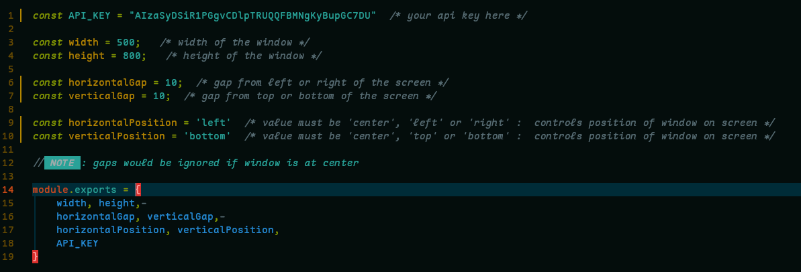
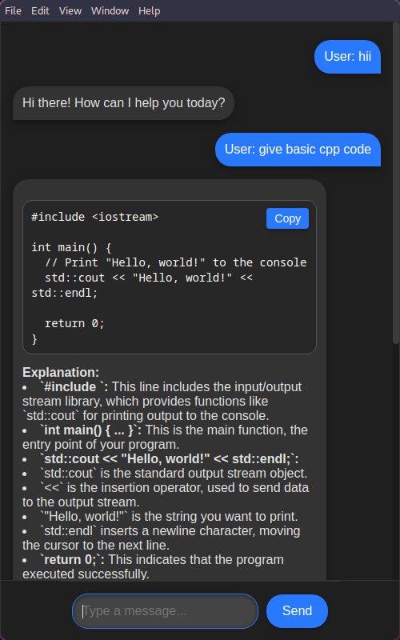

###### *<div align="right"><sub>// design by [Mahaveer](https://github.com/mahaveergurjar)</sub></div>*
# Desktop ChatBot Application

## Overview

This chat application allows users to send messages and receive responses from a language model API. It supports code formatting, explanations, and link formatting. The application uses `GoogleGenerativeAI` for API requests and displays chat messages in a styled interface.

## Features

- **User and Bot Messaging:** Sends user input to an API and displays the bot's response.
- **Code Formatting:** Formats code blocks with syntax highlighting.
- **Explanation Formatting:** Provides clear and structured explanations.
- **Link Formatting:** Automatically converts URLs into clickable links.
- **Auto Focus:** Autofocus on input so fast to type.
- **Copy:** Code copy option.
- **Position:** App screen position changing option.
- **Styled Interface:** Displays chat messages visually appealingly.
- **Dark Theme:** The application uses a dark theme for better readability in low-light environments.

## Installation

To set up and run the chat application locally, follow these steps:

### Prerequisites

- **Node.js** and **npm** (or **yarn**) installed on your machine.

### Steps

1. **Clone the Repository**

   ```bash
   git clone https://github.com/mahaveergurjar/Chatbot.git
   cd Chatboot

   ```

2. **Install Dependencies**

   `npm install`

3. **Create API Key**

   To generate an API key for Gemini AI, follow these steps:

   1. Visit the [Gemini AI API Key Generation page](https://aistudio.google.com/app/apikey?).
   2. Sign in with your Google account if prompted.
   3. Generate a new API key.
   4. Copy the generated API key.

4. **Add Your API Key**
4. **Set Up `.env` File**

   - Rename the `.env.example` file to `.env`:

     ```bash
     mv .env.example .env
     ```

   - Open the `.env` file and add your API key:

     ```env
     API_KEY=Your_Generated_API_Key
     ```

5. **Run the Application**

   `npm start`


###### *<div align="right"><sub>//credited to [Tarush Gupta](https://github.com/TarushGupta23)</sub></div>*
### Position Customization

You can adjust the app screen size and position in `config.js`:

- **X Axis:** Set to `left`, `right`, or `center`.
- **Y Axis:** Set to `top`, `bottom`, or `center`.
- **Gap:** Adjust the screen gap as needed.


<!--  -->


### Screenshot



### UI After Theme Button Added


